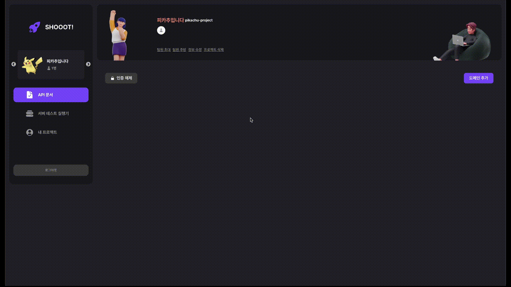
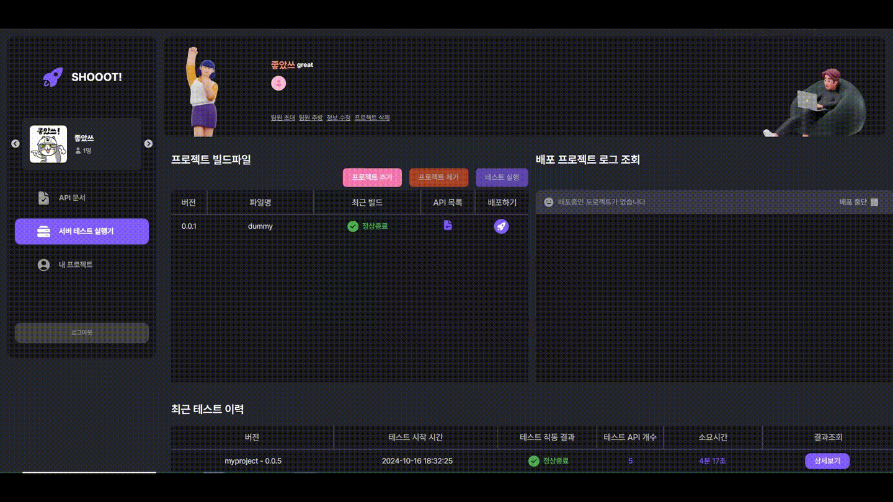

# 📖 SHOOOT!

<div align="center">


<br/>

> **주니어 개발자를 위한 GUI 기반, 개발 편의성 지원 솔루션**

<br/><br/>

### 전용 라이브러리

> shooot 라이브러리는 서비스와 연계하여 사용할 수 있습니다.

```
npm install shooot
```

🔖 [NPM SHOOOT! 바로가기](https://www.npmjs.com/package/shooot)

[](https://www.npmjs.com/package/shooot)

<br/><br/>

</div>

<br/><br/>

---

📅 **2024.10.14 ~ 2024.11.19 (5주)**

- 기획 : 1주
- 설계 : 1주
- 개발 : 3주

- 1차 테스트 : 2024.11.08
- 최종 테스트 : 2024.11.15

<br/>

👤 **팀 구성 (6명)**

- Frontend 3명
- Backend 3명

---

<br/><br/>

## 🌱 SHOOOT! 팀원 소개 🌱

|  |  |  |  |  |  |
| :-----------------------------------------------------------------------: | :--------------------------------------------------------------------: | :--------------------------------------------------------------------: | :----------------------------------------------------------------------: | :-----------------------------------------------------------------------: | :---------------------------------------------------------------------------: |
|                               최요하 `팀장`                               |                                 조성우                                 |                                 양규현                                 |                                  김현진                                  |                                  박민희                                   |                                    장철현                                     |
|                                 Frontend                                  |                             Frontend 리더                              |                                Frontend                                |                               Backend 리더                               |                                  Backend                                  |                                    Backend                                    |
|                   회원<br/>프로젝트 관리<br/>모킹 서버                    |                 API Docs<br/>알림 SSE<br/>동작 테스트                  |                 배포 등록<br/>모니터링<br/>부하 테스트                 |             인증 및 인가<br/>배포 자동화</br>콘솔 로그 조회              |                                    --                                     |                     API Docs<br/>알림 SSE<br/>동작 테스트                     |

<br/><br/>

## 프로젝트 개요

개발 초기 설계단계의 **API 명세서** 작성부터 **API 모킹**, **테스트**, **배포**, **알림**까지,  
모든 과정을 **하나의 플랫폼**에서 직관적으로 관리할 수 있다면 얼마나 편리할까요?

**SHOOOT!** 은

- **주니어 개발자**가 복잡한 설정 없이도 팀원들과 함께 체계적으로 **API 명세서를 작성**하고,

- 명세 변경 사항을 **실시간 알림**으로 구독받아 **불필요한 커뮤니케이션**과 오개발의 휴먼 에러를 줄이며,
- SHOOO!에서 작성한 API 명세서와 연동된 **NPM 모킹 라이브러리**를 통해 API 모킹 단계를 자동화하고,
- **테스트 케이스 등록**부터 **실시간 성능 모니터링**, **자동 배포**, **부하 테스트**까지  
  **원스톱**으로 처리할 수 있는 올인원 협업 플랫폼입니다.

<br/><br/>

## 주요 기능

### 1. API 명세서 작성 및 변경 알림

- **도메인** / **엔드포인트** / **파라미터** / **응답 형식** 등을 GUI 환경에서 등록
- 변경사항 발생 시 담당자가 **SSE** 기반으로 알림을 받음 → 실시간으로 확인 가능

### 2. API 테스트 케이스 & 동작 테스트

- 사전에 정의된 요청/응답 요구사항에 맞게 **테스트 케이스**를 등록
- **한 번의 클릭**으로 실제 API가 정상 동작하는지 바로 확인
- **로그 조회**를 통해 에러 원인 파악 및 디버깅 지원

### 3. 알림 & 구독

- 명세서 변경 알림 **구독** 설정
- 명세서 수정, 팀원 초대, 테스트 결과 등 다양한 이벤트를 **즉시** 확인
- **읽지 않은 알림 갯수**, **알림 읽기** 처리 등도 SSE 방식으로 간편하게 동기화

### 4. 명세서 기반 프론트엔드 Mocking

- 아직 구현되지 않은 API도 **SHOOOT!** 에서 정의된 명세를 토대로 Mock 서버를 자동 생성
- **프론트엔드**가 백엔드가 준비되기 전부터 개발을 **병렬**로 진행 가능

### 5. 서버 배포 · JAR 파일 관리

- **JAR 파일**을 업로드하면 자동으로 **도커 컨테이너**에서 실행
- **실시간 로그**와 **상태**(CPU, 메모리, I/O)를 SSE 기반으로 모니터링
- 배포 중지, 배포 재시작 등도 **UI**에서 직관적으로 제어

### 6. 부하(성능) 테스트

- **부하 스크립트**나 별도 설정 없이도, 원하는 **엔드포인트** 또는 **테스트 케이스**에 대해  
  **성능 테스트**를 실행
- 결과(처리량, 응답 시간 등)와 **시각화 그래프**를 제공해 성능 병목 지점을 빠르게 파악 가능

<br/><br/>

<details>
<summary><h2>서비스 대상</h2></summary>

<br/>

- API 명세 작성, 수정이 자주 일어나는 **팀 프로젝트**에서 협업 중이신 분
- 스펙 불일치로 인해 **프론트-백엔드 간 충돌**을 겪어본 적이 있으신 분
- **테스트**와 **배포**를 쉽게 자동화하고 싶으신 분
- **부하 테스트**, **성능 모니터링** 등의 기능을 편리하게 사용하고 싶은 주니어 개발자

<br/>

</details>

<details>
<summary><h2>✨ 서비스 장점</h2></summary>

<br/>

1. **API 명세-코드 불일치 최소화, 팀 협업 극대화**

   - API 명세서 변경 사항 알림 구독으로 **실시간**으로 인지, 빠르게 대응
   - 잦은 커뮤니케이션과 오소통 방지를 통한 비용이 크게 감소
   - SHOOOT! 서비스의 API 문서와 연동된 `NPM 모킹 자동화 라이브러리`를 통한 프론트엔드 개발 생산성 극대화

2. **간편한 테스트 & 배포**

   - 로컬 환경 설정 없이도 **클릭 몇 번**으로 **API 테스트**와 **서버 배포** 가능
   - 주니어 개발자도 **CI/CD**와 **모니터링**을 쉽게 경험

3. **생산성 향상**

   - API 명세서 작성, API 모킹, 테스트, 배포, 모니터링 등 **흩어져 있던 업무**를 **원스톱**으로 처리
   - 불필요한 작업을 **자동화**해, 핵심 개발 로직에 더 많은 시간을 투자

4. **부하 테스트 & 성능 모니터링**
   - **CPU**, **메모리**, **Disk/Network I/O** 등 **실시간** 모니터링, 문제 발생 시 즉각 대응
   - **테스트 이력**을 저장·비교해 **API별 성능 추이**를 한눈에 파악

<br/>

</details>

<div align="center">

## 🖥️ 화면 예시

## 회원 & 프로젝트

|                                                                                                                                                                                                   **프로젝트 생성**                                                                                                                                                                                                   |                                                                                                                                                                                                 **프로젝트 리스트**                                                                                                                                                                                                 |
| :-------------------------------------------------------------------------------------------------------------------------------------------------------------------------------------------------------------------------------------------------------------------------------------------------------------------------------------------------------------------------------------------------------------------: | :-----------------------------------------------------------------------------------------------------------------------------------------------------------------------------------------------------------------------------------------------------------------------------------------------------------------------------------------------------------------------------------------------------------------: |
|  |  |

|                                          **프로젝트 관리 (GIF)**                                           |                                          **팀원 관리 (GIF)**                                           |
| :--------------------------------------------------------------------------------------------------------: | :----------------------------------------------------------------------------------------------------: |
|  |  |

<br/>

## API 명세서

|                                                                                                                                                                                                                                                          **도메인 목록**                                                                                                                                                                                                                                                           |                                                                                                                                                                                                                                                    **API 목록**                                                                                                                                                                                                                                                     |
| :--------------------------------------------------------------------------------------------------------------------------------------------------------------------------------------------------------------------------------------------------------------------------------------------------------------------------------------------------------------------------------------------------------------------------------------------------------------------------------------------------------------------------------: | :-----------------------------------------------------------------------------------------------------------------------------------------------------------------------------------------------------------------------------------------------------------------------------------------------------------------------------------------------------------------------------------------------------------------------------------------------------------------------------------------------------------------: |
|  |  |

|                                                                                                                                                                                                                                                     **API 상세**                                                                                                                                                                                                                                                      |                                                                                                                                                                                                                                                                              **테스트케이스 상세**                                                                                                                                                                                                                                                                              |
| :-------------------------------------------------------------------------------------------------------------------------------------------------------------------------------------------------------------------------------------------------------------------------------------------------------------------------------------------------------------------------------------------------------------------------------------------------------------------------------------------------------------------: | :-----------------------------------------------------------------------------------------------------------------------------------------------------------------------------------------------------------------------------------------------------------------------------------------------------------------------------------------------------------------------------------------------------------------------------------------------------------------------------------------------------------------------------------------------------------------------------: |
|  |  |

|                                 **도메인 추가/편집/삭제 (GIF)**                                 |                                  **API 추가 / 수정 / 삭제 (GIF)**                                  |
| :---------------------------------------------------------------------------------------------: | :------------------------------------------------------------------------------------------------: |
|  |  |

|                               **테스트케이스 추가 / 수정 / 삭제 (GIF)**                                |                                    **ReqBody - FormData 추가 케이스 시연 (GIF)**                                    |
| :----------------------------------------------------------------------------------------------------: | :-----------------------------------------------------------------------------------------------------------------: |
|  |  |

<br/>

## 서버 테스트 실행기

|                                    **백엔드 파일 등록 (GIF)**                                    |                                        **배포 모니터링 (GIF)**                                        |
| :----------------------------------------------------------------------------------------------: | :---------------------------------------------------------------------------------------------------: |
|  |  |

|                                                                                                                                                                                           **테스트 설정**                                                                                                                                                                                            |                                   **서버 테스트 (GIF)**                                   |
| :--------------------------------------------------------------------------------------------------------------------------------------------------------------------------------------------------------------------------------------------------------------------------------------------------------------------------------------------------------------------------------------------------: | :---------------------------------------------------------------------------------------: |
|  |  |

|                                                                                                                                                                                          **API 연동 목록**                                                                                                                                                                                          |                                                                                                                                                                                                   **테스트 이력**                                                                                                                                                                                                   |
| :-------------------------------------------------------------------------------------------------------------------------------------------------------------------------------------------------------------------------------------------------------------------------------------------------------------------------------------------------------------------------------------------------: | :-----------------------------------------------------------------------------------------------------------------------------------------------------------------------------------------------------------------------------------------------------------------------------------------------------------------------------------------------------------------------------------------------------------------: |
|  |  |

</div>

<br/><br/>

## ⚙ 기술 스택

### **Front-End**


 


### **Back-End**


### **Infra & CI/CD**


### **협업 & 기타**


<br/><br/>

## 📄 API 목록

### [API 명세서 전체보기](https://pinnate-domain-1cd.notion.site/11fb6e4092238082a941da09b2954a2b?v=11fb6e409223812da73d000c1eb20340&pvs=74)


> **주요 API**
>
> - **User**: 회원가입, 로그인, 로그아웃, 프로필 조회/수정 등
> - **Project**: 프로젝트 생성/수정/삭제, 팀원 초대, 참여자 관리 등
> - **API Docs**: 도메인 등록, 엔드포인트 관리, 테스트 케이스, 구독, 알림 등
> - **Testing**: JAR 파일 업로드, 배포/중지, 부하 테스트, 로그 조회 등

<br/><br/>

## 🧱 서비스 아키텍처


<br/><br/>

## 📊 ERD


<br/><br/>

## 🖼️ 와이어프레임


<br/><br/>

## 📊 Jira


> 프로젝트 태스크, 일정관리를 위해 jira를 사용했습니다. 주단위 스프린트를 진행했습니다.

<br/><br/>

---

<div align="center">

### 감사합니다!

**SHOOOT!** 으로  
개발 효율과 협업 생산성을 극대화해 보세요.

</div>
